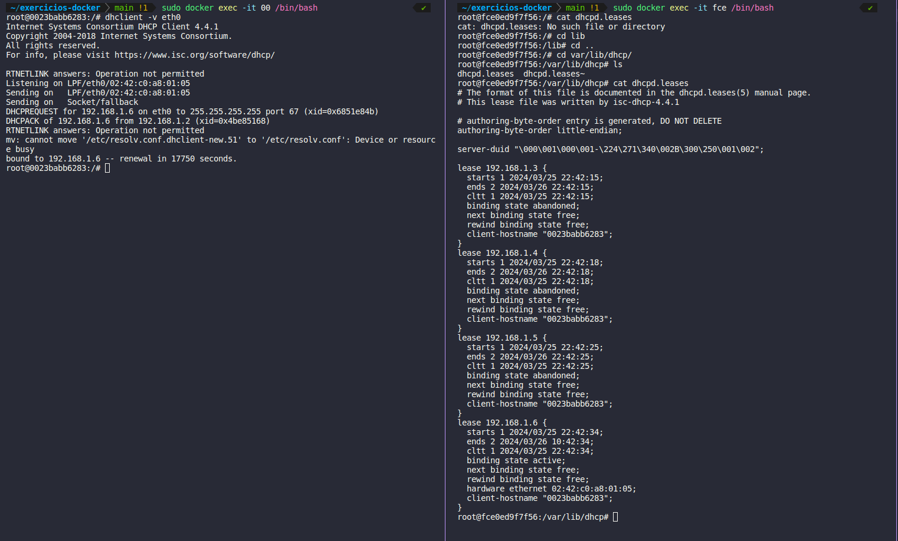
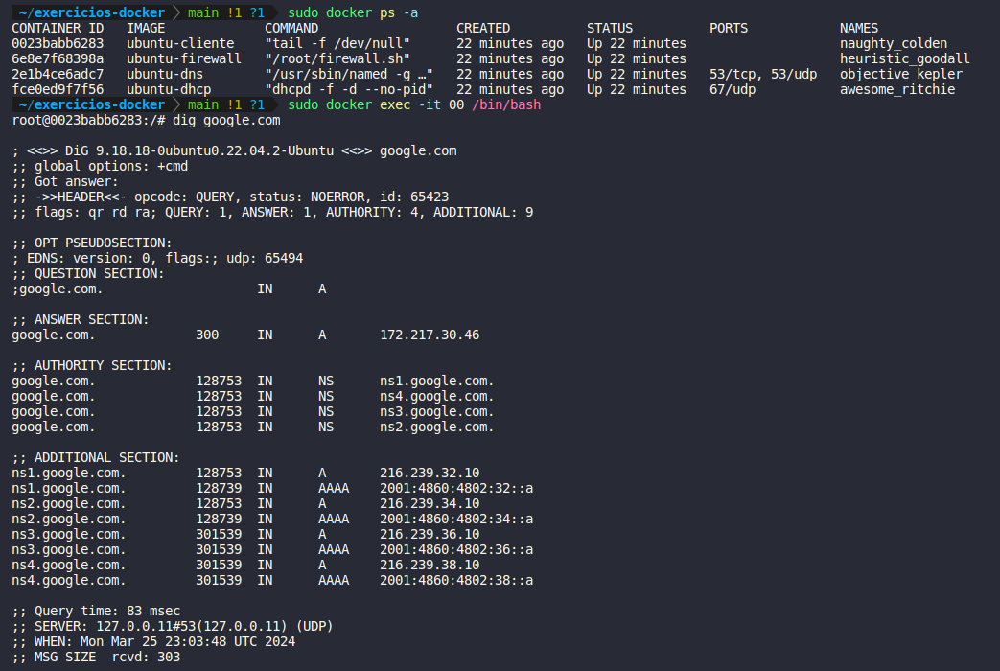
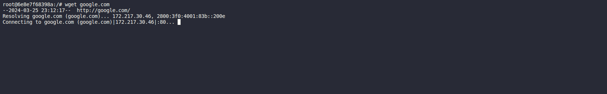

# Serviços DNS, DHCP e configuração de Firewall utilizando Docker

## Tecnologias

- Docker
- Shell

## Topologia

Primeiro foi criada uma rede "minha_rede", que seria a rede onde nossos conteiners estariam inseridos. Para a criação da mesma foi executado o seguinte comando `Shell`.

```shel
docker network create --driver bridge minha_rede
```

E posteriormente todos os conteiner serão adicionados a ela formando uma rede com os seguintes componentes:

- Conteiner Cliente (Que fará requisições de IP ao servidor DHCP)
- Conteiner DHCP (Que fornecerá os IPs aos outros serviços da rede)
- Conteiner DNS (Que resolvera os nomes de dominio)

## Execução

Para executar o projeto basta instalar as dependencias para rodar comandos `Docker`. Após instalar as dependencias basta executar o arquivo:

```shell
sh criar-ambiente.sh
```

## Testes

Foram executados alguns testes para verificar se os micro serviços fornecem o que estão sendo propostos a fazer. Estes testes serão detalhados abaixo:

- Teste do Serviço DHCP

  Foi executado utilizando o conteiner Cliente um teste de requisição, onde o conteiner cliente realiza uma requisição de ip ao servidor dhcp através do comando `dhclient -v eth0`. Após a requisição acessamos o arquivo **dhcp.leases** e verificamos que o servidor dhcp recebeu e processou a requisição.
  

- Teste do Serviço DNS

  Para testar o servidor **DNS** foi executado o comando `dig {dominio}@{ip_do_container_dns}` e então vemos que o cliente consegue fazer pesquisas por nome de domínio.
  

- Teste do Firewall

  Para testar o firewall apenas testamos se a regra de bloqueio da porta 80 está funcionando, realizando apenas um `wget google.com` e verificar se ele irá conseguir fazer ou não a requisição na porta 80.
  
